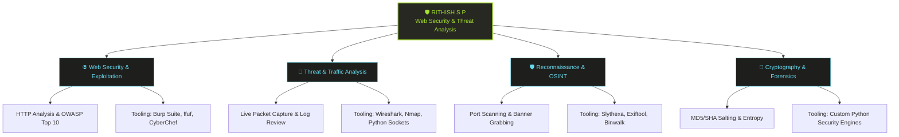
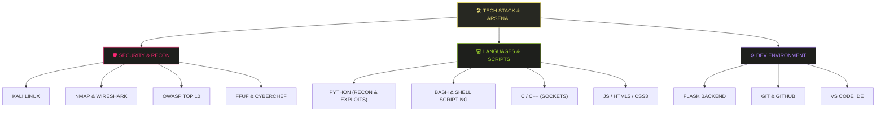

<div align="center">

  <!-- LIVE ANIME LOFI MOVING SVG BANNER -->
  

  <br/><br/>

  <!-- DYNAMIC TYPING SVG ANIMATION MONOKAI THEME -->
  <a href="https://git.io/typing-svg">
    
  </a>

  <br/><br/>

  <!-- BADGE HUB -->
  
  

  <br/><br/>

  <!-- MONOKAI QUICK-JUMP NAVIGATION BAR -->
  <a href="#-monokai-terminal-dossier"></a>
  <a href="#-cybersecurity-domain-architecture"></a>
  <a href="#-tech-stack--arsenal-hierarchy"></a>
  <a href="#-featured-security-projects"></a>
  <a href="#-profile-analytics--activity"></a>

  <br/><br/>

  <!-- CONNECT BUTTONS -->
  <a href="https://www.linkedin.com/in/rithish-s-p-0171ba377/">
    
  </a>
  <a href="mailto:sprithish1409@gmail.com">
    
  </a>
  <a href="https://github.com/Ritzz-09">
    
  </a>

</div>

<br/>

---

## 💻 MONOKAI TERMINAL DOSSIER

<div align="center">
  <!-- DIRECT ZERO-UPLOAD DYNAMIC LIVE TYPING SVG -->
  <a href="https://git.io/typing-svg">
    
  </a>
</div>

<br/>

> 💬 *"Computer Science & Engineering student focused on Web Security and Threat Analysis. Building Python-based security tools for network reconnaissance, packet inspection, and traffic analysis."*

---

## 🌲 CYBERSECURITY DOMAIN ARCHITECTURE



---

## 🌴 TECH STACK & ARSENAL HIERARCHY



### 💻 Carbon Shell Tree Output
<div align="center">
  <table width="100%">
    <tr>
      <td bgcolor="#1e1f1c" style="border: 1px solid #3e3d32; border-radius: 8px; padding: 18px;">
        <pre style="background: transparent; color: #a6e22e; font-family: 'Fira Code', monospace; text-align: left; margin: 0; line-height: 1.6; font-size: 13px;">
<span style="color: #fd971f;">user@rithish-security-node</span>:<span style="color: #66d9ef;">~/arsenal</span>$ tree ./tools_and_languages

<span style="color: #f92672;">[+] LOADING MONOKAI ARSENAL TREE...</span>
.
├── 🛡️  SECURITY_TOOLS
│   ├── [✓] Kali Linux .......... OS &amp; Penetration Testing Environment
│   ├── [✓] Nmap ................ Network Scanner &amp; Service Discovery
│   ├── [✓] Wireshark ........... Packet Inspection &amp; Protocol Analysis
│   ├── [✓] OWASP Top 10 ........ Web Security Standard &amp; Audit Framework
│   ├── [✓] ffuf ................ Directory Fuzzer &amp; Web Brute-forcer
│   └── [✓] CyberChef ........... Web Swiss Army Knife for Encoding
│
└── 💻  LANGUAGES_AND_FRAMEWORKS
    ├── [✓] Python .............. Primary Recon &amp; Exploit Scripting
    ├── [✓] Bash / Shell ........ System Automation &amp; Shell Scripting
    ├── [✓] C / C++ ............. Low-Level Network Socket Programming
    ├── [✓] Flask ............... Micro-backend for Python Security Engines
    └── [✓] Git &amp; GitHub ........ Version Control &amp; Open Source Repositories
        </pre>
      </td>
    </tr>
  </table>
</div>

---

## 🚀 FEATURED SECURITY PROJECTS

<table width="100%">
  <tr>
    <td bgcolor="#1e1f1c" style="border: 1px solid #3e3d32; border-radius: 8px; padding: 18px;">
      <h3 style="margin-top: 0; color: #a6e22e;">🛡️ 01. <a href="https://github.com/Ritzz-09/Slythexa" style="color: #a6e22e; text-decoration: none;">Slythexa — Modular Reconnaissance Framework</a></h3>
      <p style="color: #f8f8f2;">High-performance modular recon framework built in Python. Features automated TCP port scanning, banner grabbing, DNS/WHOIS lookups, and HTTP header auditing with JSON reporting.</p>
      <p style="color: #66d9ef; font-family: monospace;"><b>Tech:</b> Python · Socket · JSON · CLI · Network Security</p>
    </td>
  </tr>
  <tr><td height="12"></td></tr>
  <tr>
    <td bgcolor="#1e1f1c" style="border: 1px solid #3e3d32; border-radius: 8px; padding: 18px;">
      <h3 style="margin-top: 0; color: #66d9ef;">🤖 02. <a href="https://github.com/Ritzz-09/codeforge" style="color: #66d9ef; text-decoration: none;">Codi Craft / Codeforge — AI Coding Assistant</a></h3>
      <p style="color: #f8f8f2;">Full-stack prototype powered by Flask and Groq API for prompt-driven code generation, bug refactoring, and vulnerability explanation.</p>
      <p style="color: #e6db74; font-family: monospace;"><b>Tech:</b> JavaScript · Flask · Groq API · HTML5 · CSS3</p>
    </td>
  </tr>
  <tr><td height="12"></td></tr>
  <tr>
    <td bgcolor="#1e1f1c" style="border: 1px solid #3e3d32; border-radius: 8px; padding: 18px;">
      <h3 style="margin-top: 0; color: #f92672;">🔬 03. Custom Security Toolkits &amp; Labs</h3>
      <p style="color: #f8f8f2;">A portfolio of 7 hands-on security labs analyzing attack vectors:</p>
      <ul style="color: #f8f8f2; line-height: 1.6;">
        <li>📡 <b>Live Packet Sniffer</b>: Inspects raw packet headers and IP traffic.</li>
        <li>🔎 <b>TCP Port Scanner</b>: Scans open ports and detects active services.</li>
        <li>⌨️ <b>Keystroke Monitor</b>: Educational keylogger examining input logging.</li>
        <li>🔓 <b>Password Cracker</b>: Brute-force dictionary cracker for MD5, SHA-1, SHA-256.</li>
        <li>📊 <b>Password Strength Evaluator</b>: Entropy-based security metric engine.</li>
        <li>🔑 <b>Hashing &amp; Salting Engine</b>: Implemented salted cryptographic hash engine.</li>
        <li>⚡ <b>Reverse Shell Lab</b>: Client-server command channel analysis.</li>
      </ul>
    </td>
  </tr>
</table>

---

## 📌 ROADMAP & TARGET GOALS

```yaml
focus:
  - Web Vulnerability Assessment & OWASP Top 10
  - Digital Forensics & Log Analysis (Exiftool, Binwalk)
  - Network Traffic Analysis & Packet Inspection (Wireshark, ffuf)
building:
  - Python Security Toolkits & Traffic Monitoring Labs
goal:
  - Aspiring Web Security Analyst Specializing in Threat Detection
```

---

## 📊 PROFILE ANALYTICS & ACTIVITY

<div align="center">
  <table width="100%">
    <tr>
      <td bgcolor="#1e1f1c" style="border: 1px solid #3e3d32; border-radius: 8px; padding: 20px; text-align: center;">
        <h4 style="color: #66d9ef; font-family: monospace; margin-top: 0;">⚡ MONOKAI SYSTEM METRICS HUD</h4>
        <br/>
        
        &nbsp;&nbsp;
        
        <br/><br/>
        
        &nbsp;&nbsp;
        
      </td>
    </tr>
  </table>

  <br/><br/>

  <!-- GITHUB CONTRIBUTION SNAKE ANIMATION -->
  
</div>

---

## 🌐 CONNECT WITH ME

<div align="center">
  <a href="https://www.linkedin.com/in/rithish-s-p-0171ba377/">
    
  </a>
  <a href="mailto:sprithish1409@gmail.com">
    
  </a>
  <a href="https://github.com/Ritzz-09">
    
  </a>
</div>

<br/>

<div align="center">
  
  <br/><br/>
  <!-- FULL-WIDTH WAVING MONOKAI FOOTER BANNER -->
  
</div>
