  <!-- HERO BANNER -->
  

    

  <!-- DYNAMIC TYPING HEADER -->
  

    

  <!-- HIGHLIGHT BADGES (CLICKING ISACA BADGE DIRECTS TO LINKEDIN POST) -->
  
  
  

    

  <!-- QUICK NAVIGATION ANCHORS -->
  
  
  
  
  

    

  <!-- SOCIAL / CONNECT BUTTONS -->
  
  
  
  

 

---

## 💻 TERMINAL DOSSIER

  <table width="100%">
    <tr>
      <td bgcolor="#000000" style="background-color: #000000; border: 1px solid #30363d; border-radius: 8px; padding: 16px 20px;">
        

          ●&nbsp;
          ●&nbsp;
          ●
          &nbsp;&nbsp;
          user@rithish-sec: ~ (bash)
        

        
      </td>
    </tr>
  </table>

 

> 💬 *"Computer Science & Engineering student focused on Web Security, Threat Analysis, and Network Reconnaissance. Passionate about uncovering web vulnerabilities, packet inspection, building Python-based security toolkits, and offensive-defensive cyber operations."*

---

## 🏆 HONORS & ACHIEVEMENTS

<table width="100%">
  <tr>
    <td bgcolor="#000000" style="background-color: #000000; border: 1.5px solid #ffd700; border-radius: 8px; padding: 22px;">
      

        

          <h3 style="margin: 0; color: #ffd700;">
            🥇 <a href="https://www.linkedin.com/feed/update/urn:li:activity:7507331341433249792/" target="_blank" style="color: #ffd700; text-decoration: none;">1st Place — ISACA CTF 2026 (Secure AI Summit) ↗</a>
          </h3>
          

            <b>Organized by:</b> ISACA Trivandrum Chapter &bull; <b>Team:</b> FLAGGERS UNITED &bull; <b>Award:</b> Certificate of Excellence
          

        

        

          
        

      

      

      

        Secured <b>1st Place (Certificate of Excellence)</b> in the Capture The Flag competition at the <b>Secure AI Summit 2026</b> organized by the <b>ISACA Trivandrum Chapter</b>. Representing team <b>FLAGGERS UNITED</b> alongside teammates Subadevan C and Prasanna Venkatesh T, solving high-intensity challenges across core cybersecurity disciplines:
      

      <ul style="color: #f8f8f2; line-height: 1.6;">
        <li>🌐 <b>Web Exploitation</b>: Identifying and exploiting complex OWASP vulnerabilities, authorization bypass, and input tampering.</li>
        <li>🔎 <b>Digital Forensics &amp; OSINT</b>: Analyzing network PCAPs, packet reconstruction, memory dumps, and intelligence gathering.</li>
        <li>🔐 <b>Cryptography</b>: Cracking multi-stage ciphers, hash salting reversal, and statistical entropy analysis.</li>
        <li>⚡ <b>Reverse Engineering</b>: Binary inspection, decompilation workflows, and payload execution tracing.</li>
      </ul>
      

        
        &nbsp;
        
        &nbsp;
        
        &nbsp;
        
      

    </td>
  </tr>
</table>

---

## 🌲 CYBERSECURITY DOMAIN ARCHITECTURE

```mermaid
graph TD
    Root["🛡️ RITHISH S P<br/>Web Security Analyst & Threat Hunter"]
    
    Root --> WebSec["🌐 Web Security & Exploitation"]
    Root --> Threat["🔎 Threat & Traffic Analysis"]
    Root --> Recon["📡 Reconnaissance & OSINT"]
    Root --> Crypto["🔐 Cryptography & Forensics"]
    Root --> AppDev["⚙️ Security Tooling & Architecture"]

    WebSec --> W1["OWASP Top 10, Auth Bypass & Injection"]
    WebSec --> W2["Tooling: Burp Suite, ffuf, CyberChef"]

    Threat --> T1["Live Packet Capture & Protocol Decoding"]
    Threat --> T2["Tooling: Wireshark, Nmap, Python Sockets"]

    Recon --> R1["Automated Port Scanning & Fingerprinting"]
    Recon --> R2["Tooling: Slythexa, Port-scanner, Recon Scripts"]

    Crypto --> C1["Hash Salting, Entropy & Cipher Analysis"]
    Crypto --> C2["Tooling: Password-cracker, Security Analyzer"]

    AppDev --> A1["FloatChat: AI 4D Ocean Intelligence Platform"]
    AppDev --> A2["Life-XP & Codi Craft (Groq API Systems)"]

    style Root fill:#161b22,stroke:#a6e22e,stroke-width:2px,color:#a6e22e
    style WebSec fill:#000000,stroke:#58a6ff,stroke-width:1px,color:#58a6ff
    style Threat fill:#000000,stroke:#f0883e,stroke-width:1px,color:#f0883e
    style Recon fill:#000000,stroke:#ff7b72,stroke-width:1px,color:#ff7b72
    style Crypto fill:#000000,stroke:#d2a8ff,stroke-width:1px,color:#d2a8ff
    style AppDev fill:#000000,stroke:#a6e22e,stroke-width:1px,color:#a6e22e
```

---

## 🌴 TECH STACK & ARSENAL HIERARCHY

```mermaid
graph TD
    HOME["🛠️ TECH STACK & ARSENAL HIERARCHY"]

    HOME --> SEC["🛡️ CYBERSECURITY & RECON"]
    HOME --> LANG["💻 CORE LANGUAGES"]
    HOME --> WEB["🌐 WEB & DATA PLATFORMS"]
    HOME --> DEV["⚙️ DEV & ENVIRONMENT"]

    SEC --> S1["Kali Linux & Penetration Testing"]
    SEC --> S2["Wireshark & Nmap (Traffic Inspection)"]
    SEC --> S3["OWASP Top 10 & Web Exploitation"]
    SEC --> S4["ffuf, Burp Suite & CyberChef"]

    LANG --> L1["Python 3 (Recon Frameworks & Threat Engines)"]
    LANG --> L2["TypeScript / JavaScript (Interactive Systems)"]
    LANG --> L3["C / C++ (Low-Level Network Sockets)"]
    LANG --> L4["Bash & Linux POSIX Shell Scripting"]
    LANG --> L5["SQL & DuckDB (High-Speed Columnar Auditing)"]

    WEB --> W1["React 18 & Next.js UI Architectures"]
    WEB --> W2["FastAPI & Flask Backend APIs"]
    WEB --> W3["4D WebGL Scientific Globe & Tailwind CSS"]
    WEB --> W4["Groq API AI Inference Engine"]

    DEV --> D1["Git & GitHub Version Control"]
    DEV --> D2["VS Code & Linux POSIX Terminals"]
    DEV --> D3["Postman (API Testing & Auditing)"]
    DEV --> D4["Vercel Cloud Deployment"]

    style HOME fill:#161b22,stroke:#ffd700,stroke-width:2px,color:#ffd700
    style SEC fill:#000000,stroke:#ff7b72,stroke-width:1px,color:#ff7b72
    style LANG fill:#000000,stroke:#a6e22e,stroke-width:1px,color:#a6e22e
    style WEB fill:#000000,stroke:#58a6ff,stroke-width:1px,color:#58a6ff
    style DEV fill:#000000,stroke:#d2a8ff,stroke-width:1px,color:#d2a8ff
```

### 💻 Carbon Shell Tree Output

  <table width="100%">
    <tr>
      <td bgcolor="#000000" style="background-color: #000000; border: 1px solid #30363d; border-radius: 8px; padding: 20px;">
        <pre style="background: transparent; color: #a6e22e; font-family: 'Fira Code', Consolas, Monaco, monospace; text-align: left; margin: 0; line-height: 1.7; font-size: 13px;">
user@rithish-security-node:~/arsenal$ tree ./tech_stack --dirsfirst -C

[+] LOADING ARSENAL TREE...
.
├── 🛡️  <b>SECURITY_AND_FORENSICS</b>
│   ├── [✓] Kali Linux .......... Primary Penetration Testing &amp; Security OS
│   ├── [✓] Wireshark ........... Deep Packet Inspection &amp; Protocol Analysis
│   ├── [✓] Nmap ................ Host Discovery, Port Scanning &amp; Service Recon
│   ├── [✓] Burp Suite .......... Web App Proxy, Request Interception &amp; Testing
│   ├── [✓] OWASP Top 10 ........ Web Vulnerability Analysis (XSS, SQLi, SSRF)
│   ├── [✓] ffuf ................ High-Speed Directory &amp; Parameter Fuzzing
│   ├── [✓] CyberChef ........... Swiss Army Knife for Ciphers &amp; Hash Decoding
│   └── [✓] Binwalk / Exiftool .. Firmware &amp; Digital Metadata Forensics
│
├── 💻  <b>PROGRAMMING_LANGUAGES</b>
│   ├── [✓] Python 3 ............ Primary Recon Frameworks &amp; Exploit Engines
│   ├── [✓] TypeScript .......... Type-Safe Web Applications &amp; Interfaces
│   ├── [✓] JavaScript (ES6+) ... Dynamic Interactive Client Logic
│   ├── [✓] C / C++ ............. Low-Level Network Socket &amp; Systems Programming
│   ├── [✓] Bash / POSIX ........ Shell Automation, Tool Chaining &amp; Linux Scripting
│   └── [✓] SQL / DuckDB ........ Columnar Analytics &amp; Database Security Auditing
│
├── 🌐  <b>WEB_DATA_AND_AI_STACK</b>
│   ├── [✓] React 18 &amp; Vite ..... High-Performance Component UI Architecture
│   ├── [✓] Next.js ............. Production React Framework
│   ├── [✓] FastAPI &amp; Flask ..... Micro-Backends for Python Security &amp; Analytics
│   ├── [✓] DuckDB .............. Sub-10ms Columnar Analytical SQL Engine
│   ├── [✓] 4D WebGL ............ Planetary Interactive Spatiotemporal Rendering
│   ├── [✓] Groq API ............ Ultra-Fast LPU AI Code &amp; Logic Inference
│   ├── [✓] Tailwind CSS ........ Utility-First Responsive Styling
│   └── [✓] Vercel .............. Continuous Cloud Deployment &amp; Hosting
│
└── ⚙️  <b>DEV_AND_SYSTEM_TOOLS</b>
    ├── [✓] Git &amp; GitHub ........ Version Control, Workflows &amp; Open Source
    ├── [✓] Linux (Debian/Arch) . System Administration &amp; POSIX Environments
    ├── [✓] VS Code ............. Primary Code Editor &amp; Debugging Environment
    └── [✓] Postman ............. API Request Construction &amp; Security Auditing
        </pre>
      </td>
    </tr>
  </table>

---

## 🚀 FEATURED PROJECTS

<table width="100%">
  <!-- PROJECT 1: FLOATCHAT -->
  <tr>
    <td bgcolor="#000000" style="background-color: #000000; border: 1px solid #30363d; border-radius: 8px; padding: 20px;">
      

        <h3 style="margin: 0; color: #58a6ff;">
          🌊 01. <a href="https://github.com/Ritzz-09/Floatchat" style="color: #58a6ff; text-decoration: none;">FloatChat — AI-Powered 4D Spatiotemporal Ocean Intelligence Platform</a>
        </h3>
      

      

        An advanced oceanographic intelligence platform (<i>"Talk to the Ocean"</i>) allowing researchers and scientists to query global robotic ARGO float observations in plain English. Features an interactive 4D WebGL globe, sub-10ms DuckDB columnar analytics, Pydantic validation, and deterministic anomaly forecasting.
      

      

        <b>Tech Stack:</b> TypeScript · React 18 · Vite · 4D WebGL · FastAPI · DuckDB · Pydantic
      

      

        
        &nbsp;
        
        &nbsp;
        
      

    </td>
  </tr>

  <tr><td height="14"></td></tr>

  <!-- PROJECT 2: SLYTHEXA -->
  <tr>
    <td bgcolor="#000000" style="background-color: #000000; border: 1px solid #30363d; border-radius: 8px; padding: 20px;">
      

        <h3 style="margin: 0; color: #a6e22e;">
          🛡️ 02. <a href="https://github.com/Ritzz-09/Slythexa" style="color: #a6e22e; text-decoration: none;">Slythexa — Modular Network Reconnaissance Framework</a>
        </h3>
      

      

        A high-performance, modular Python reconnaissance framework for automated network intelligence gathering. Features concurrent TCP port scanning, service banner grabbing, WHOIS/DNS footprinting, HTTP security header auditing, and JSON exports.
      

      

        <b>Tech Stack:</b> Python 3 · Sockets · Threading · CLI · Network Recon
      

      

        
        &nbsp;
        
      

    </td>
  </tr>

  <tr><td height="14"></td></tr>

  <!-- PROJECT 3: LIFE-XP -->
  <tr>
    <td bgcolor="#000000" style="background-color: #000000; border: 1px solid #30363d; border-radius: 8px; padding: 20px;">
      

        <h3 style="margin: 0; color: #ff7b72;">
          🌟 03. <a href="https://github.com/Ritzz-09/Life-XP" style="color: #ff7b72; text-decoration: none;">Life-XP — Gamified Life Management Platform</a>
        </h3>
      

      

        An interactive productivity web platform that transforms everyday habits, tasks, and personal growth into an engaging RPG-style leveling system. Features live progress tracking, streak rewards, and responsive dashboards.
      

      

        <b>Tech Stack:</b> TypeScript · React · Next.js · Modern UI · Vercel
      

      

        
        &nbsp;
        
      

    </td>
  </tr>

  <tr><td height="14"></td></tr>

  <!-- PROJECT 4: CODI CRAFT / CODEFORGE -->
  <tr>
    <td bgcolor="#000000" style="background-color: #000000; border: 1px solid #30363d; border-radius: 8px; padding: 20px;">
      

        <h3 style="margin: 0; color: #ffd700;">
          🤖 04. <a href="https://github.com/Ritzz-09/codeforge" style="color: #ffd700; text-decoration: none;">Codi Craft (Codeforge) — AI Coding Assistant</a>
        </h3>
      

      

        An intelligent AI-assisted code generator and debugging prototype powered by the Groq API. Enables natural-language prompt synthesis, automated vulnerability inspection, bug fixes, and step-by-step code architecture explanations.
      

      

        <b>Tech Stack:</b> JavaScript · Flask · Python · Groq API · HTML5 · CSS3
      

      

        
        &nbsp;
        
      

